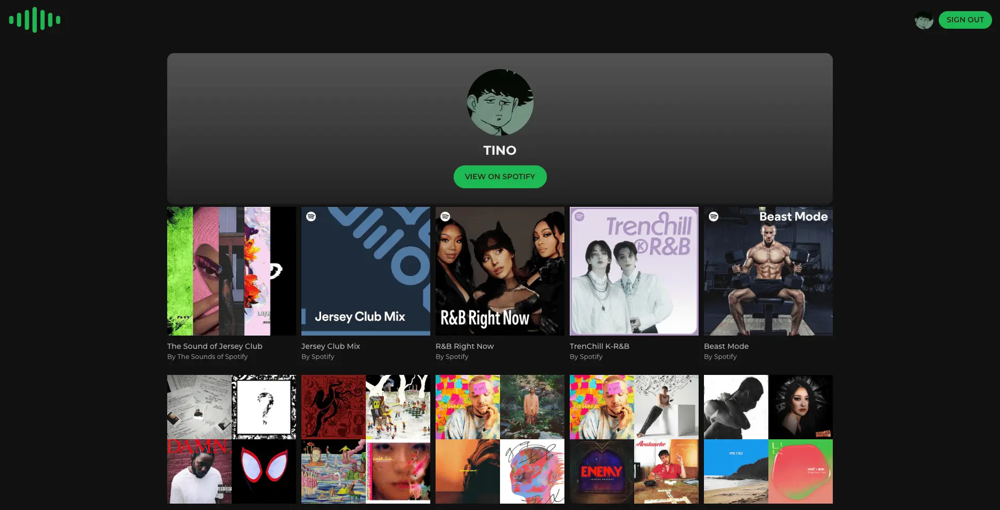
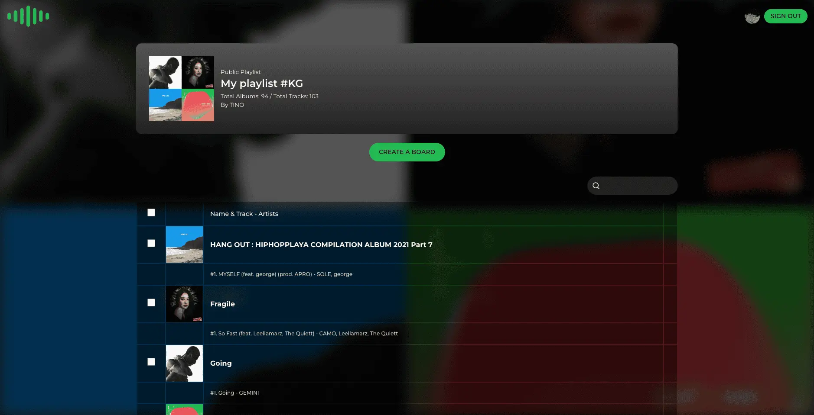
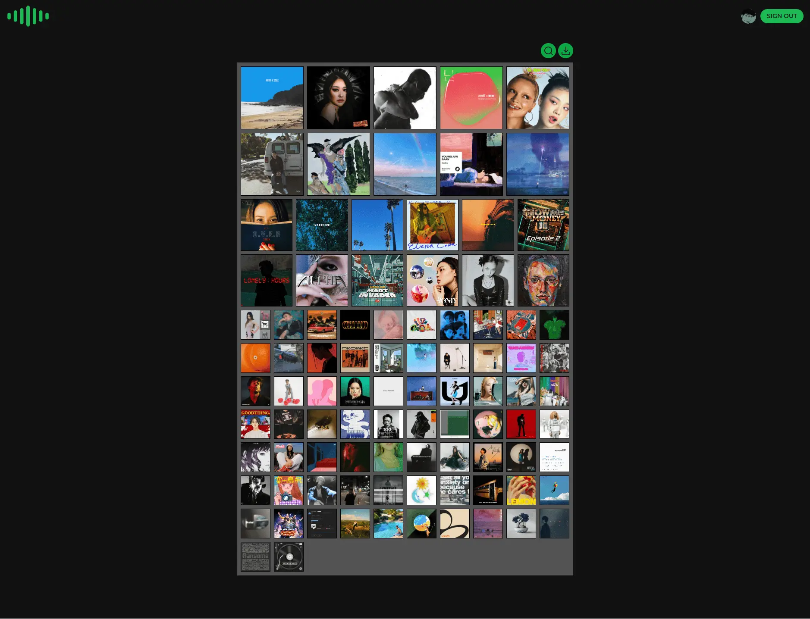
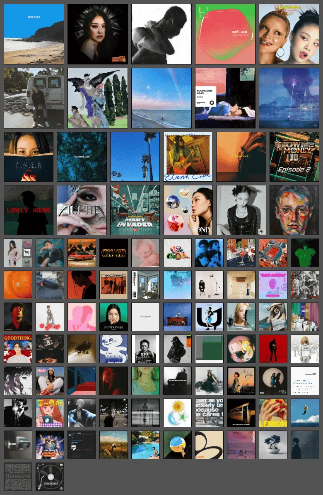

A project using the Spotify API to generate a topster from personal playlists, visualizing favorite albums or songs in a grid format.

### Set up environment variables

   - Create a project and get a client id from Spotify Developer Dashboard
     <https://developer.spotify.com/documentation/web-api/concepts/apps/>
   - Create a `.env` file in the root directory of the project.
   - Refer to the `.env.example` file and set up the required environment variables in the `.env` file.

   ```plaintext
   REACT_APP_CLIENT_ID=your_client_id
   REACT_APP_SITE_URL=your_api_key_here (http://localhost:3000)
   ```

### Pages

|  |  |
| :----------------------------------: | :-----------------------------------: |
|             Landing Page             |             Playlist Page             |

|  |
| :--------------------------------: |
|             Board Page             |

### Downloaded Result



### STACKS:

<div>
  
  
</div>

- Context API
- Spotify API

### More:

If you have any further inquiries or feedback regarding the website, feel free to reach out at any time.
